# Panduan Penggunaan Admin Panel — GreenHaven

**URL Admin:** `/admin`  
**Login default:** `admin@greenhaven.id` / `password`

---

## Daftar Isi

1. [Dashboard](#1-dashboard)
2. [Produk](#2-produk)
3. [Kategori](#3-kategori)
4. [Pesanan](#4-pesanan)
5. [Konfirmasi Pembayaran](#5-konfirmasi-pembayaran)
6. [Metode Pembayaran](#6-metode-pembayaran)
7. [Kupon & Voucher](#7-kupon--voucher)
8. [Blog](#8-blog)
9. [FAQ](#9-faq)
10. [Newsletter](#10-newsletter)
11. [Pengguna](#11-pengguna)
12. [Zona Pengiriman](#12-zona-pengiriman)
13. [Laporan Penjualan](#13-laporan-penjualan)
14. [Pengaturan API](#14-pengaturan-api)
15. [Pengaturan Situs](#15-pengaturan-situs)

---

## 1. Dashboard

Halaman pertama setelah login. Menampilkan ringkasan operasional toko secara real-time.

**Informasi yang tersedia:**
- Total pendapatan keseluruhan
- Jumlah pesanan aktif (pending + processing)
- Jumlah subscriber newsletter
- Statistik produk (total & aktif)
- Grafik tren pesanan dan pendapatan harian
- Breakdown status pesanan (pie chart)
- Daftar pesanan terbaru

**Shortcut:** Tombol "Kelola Pesanan" dan "Kelola Produk" tersedia langsung di hero dashboard.

---

## 2. Produk

**Menu:** Produk → Daftar Produk

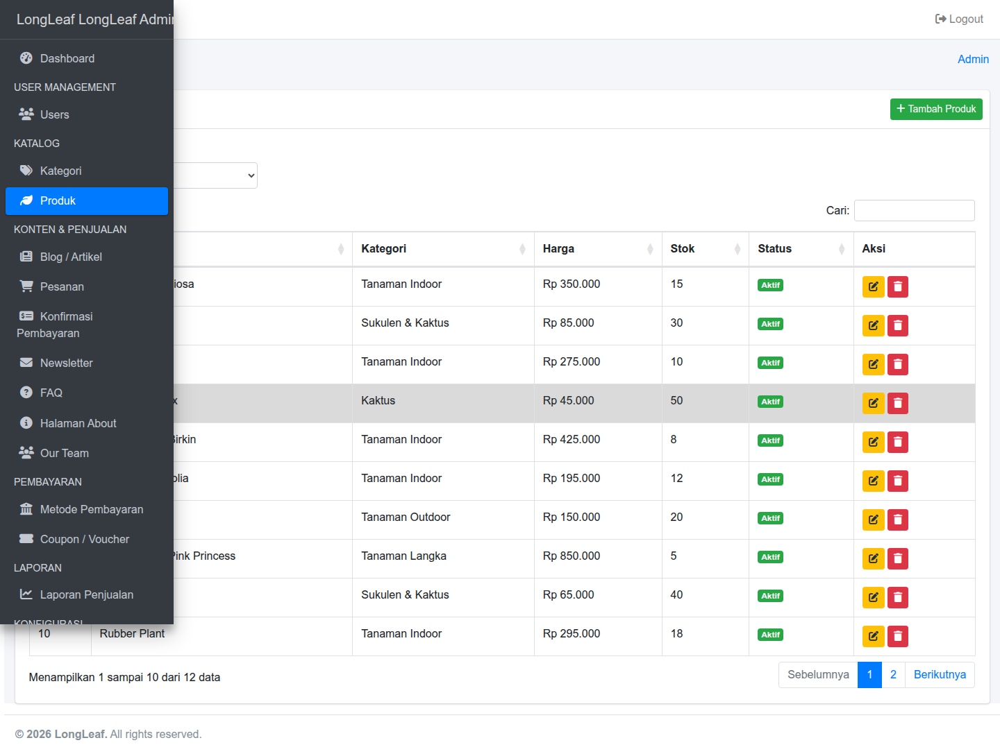

### Menambah Produk Baru

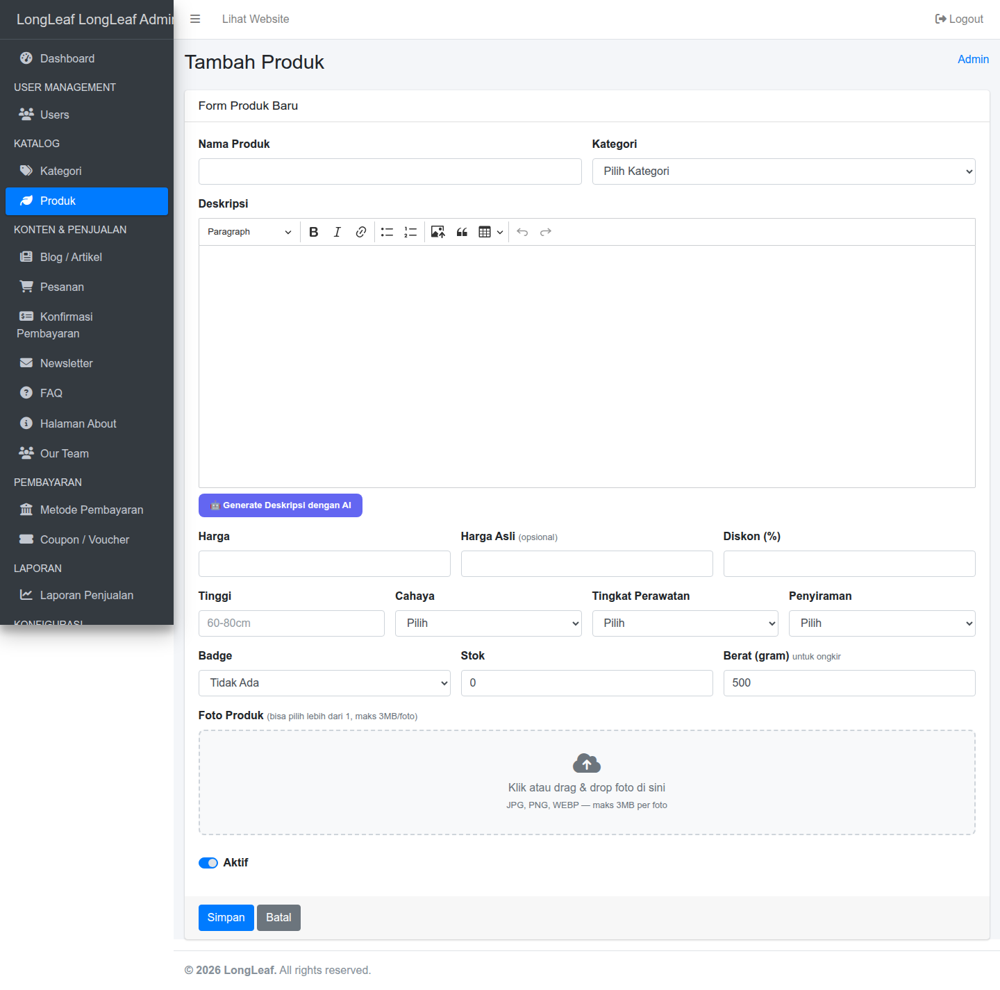

1. Klik tombol **Tambah Produk**
2. Isi form:
   - **Nama Produk** — wajib diisi
   - **Kategori** — pilih dari dropdown
   - **Deskripsi** — bisa diisi manual atau klik **🤖 Generate Deskripsi dengan AI** untuk membuat deskripsi otomatis menggunakan Groq AI
   - **Harga** — harga jual (wajib)
   - **Harga Asli** — harga sebelum diskon (opsional, untuk menampilkan coret harga)
   - **Diskon (%)** — persentase diskon (opsional)
   - **Tinggi** — contoh: `60-80cm`
   - **Cahaya** — pilih level kebutuhan cahaya
   - **Penyiraman** — frekuensi penyiraman
   - **Tingkat Perawatan** — mudah / sedang / sulit
   - **Stok** — jumlah stok tersedia
   - **Badge** — label khusus (New, Best Seller, dll.)
   - **Gambar** — upload satu atau lebih foto produk
3. Klik **Simpan**

### Mengedit Produk

Klik ikon **Edit** (pensil) pada baris produk di tabel. Form yang sama akan muncul dengan data yang sudah terisi.

### Menonaktifkan Produk

Centang/uncentang toggle **Aktif** pada form edit. Produk nonaktif tidak muncul di storefront.

### Menghapus Produk

Klik ikon **Hapus** (tempat sampah) → konfirmasi dialog.

---

## 3. Kategori

**Menu:** Kategori

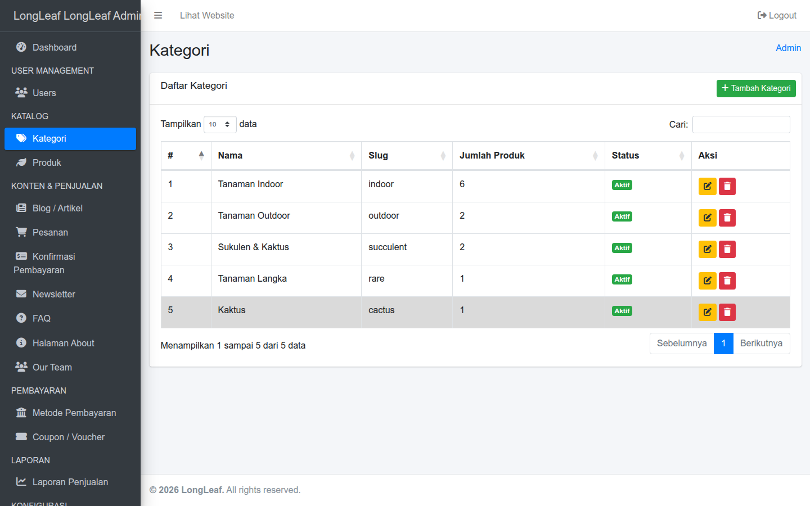

Digunakan untuk mengelompokkan produk di storefront.

| Aksi | Cara |
|---|---|
| Tambah | Klik **Tambah Kategori**, isi nama & slug |
| Edit | Klik ikon pensil |
| Hapus | Klik ikon tempat sampah |

> Slug dibuat otomatis dari nama kategori. Bisa diubah manual jika diperlukan.

---

## 4. Pesanan

**Menu:** Pesanan

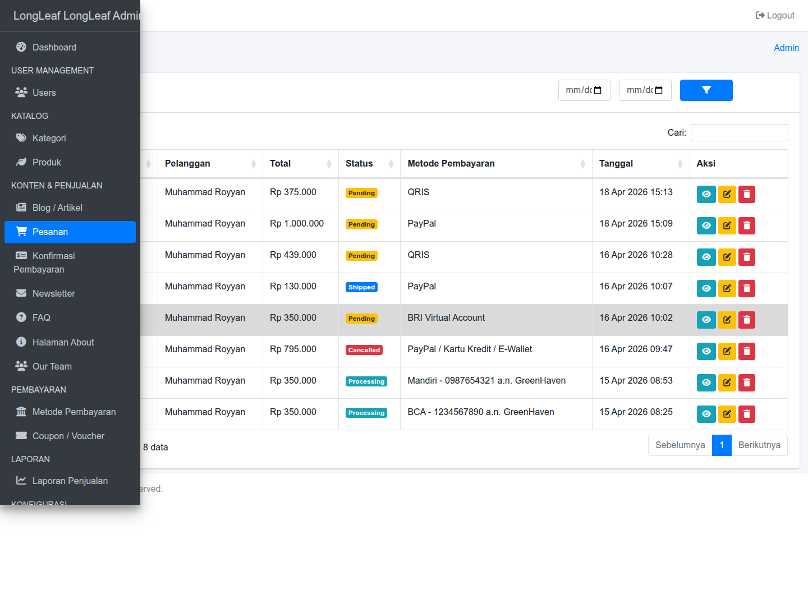

### Melihat Daftar Pesanan

Tabel menampilkan semua pesanan dengan kolom: nomor pesanan, nama pelanggan, total, status, dan tanggal.

**Status pesanan:**

| Status | Keterangan |
|---|---|
| `pending` | Pesanan baru, belum ada pembayaran |
| `awaiting_confirmation` | Pelanggan sudah upload bukti transfer |
| `processing` | Pembayaran dikonfirmasi, sedang diproses |
| `shipped` | Pesanan sudah dikirim |
| `completed` | Pesanan selesai diterima |
| `cancelled` | Pesanan dibatalkan |

### Melihat Detail Pesanan

Klik nomor pesanan atau ikon **Detail** untuk melihat:
- Data pelanggan (nama, email, telepon, alamat)
- Metode pembayaran
- Daftar item yang dipesan
- Bukti pembayaran (jika sudah diupload)
- Riwayat status

### Mengubah Status Pesanan

1. Buka detail pesanan
2. Klik tombol **Edit Status**
3. Pilih status baru dari dropdown
4. Isi nomor resi pengiriman (jika status = `shipped`)
5. Klik **Simpan**

---

## 5. Konfirmasi Pembayaran

**Menu:** Konfirmasi Pembayaran

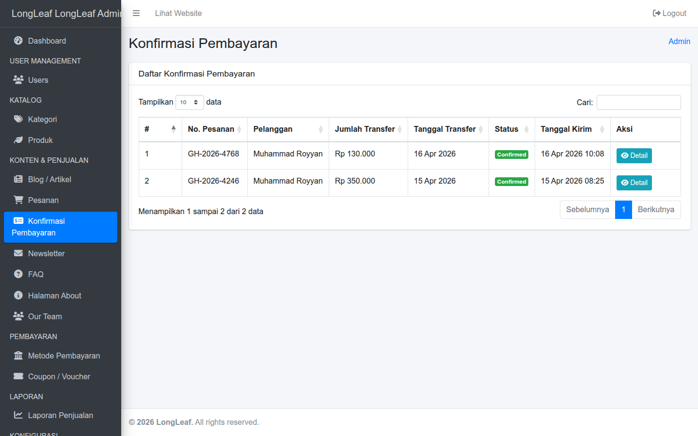

Digunakan untuk memverifikasi bukti transfer manual yang diupload pelanggan.

### Alur Verifikasi

1. Pelanggan checkout dengan metode transfer manual
2. Pelanggan upload foto bukti transfer
3. Notifikasi muncul di menu ini
4. Admin membuka detail konfirmasi:
   - Lihat nama pengirim, bank, jumlah transfer, dan foto bukti
5. Klik **Approve** jika valid → status pesanan otomatis berubah ke `processing`
6. Klik **Reject** jika tidak valid → pesanan kembali ke `pending`

---

## 6. Metode Pembayaran

**Menu:** Metode Pembayaran

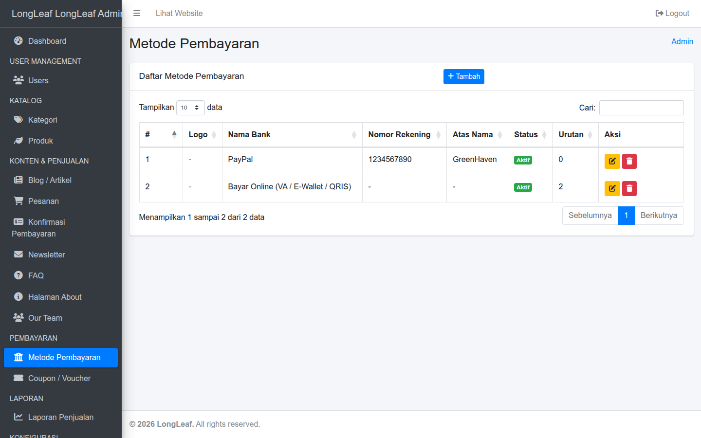

Kelola metode pembayaran manual (transfer bank) yang tersedia di checkout.

| Aksi | Cara |
|---|---|
| Tambah | Klik **Tambah**, isi nama bank, nomor rekening, nama pemilik, upload logo |
| Edit | Klik ikon pensil |
| Aktif/Nonaktif | Toggle pada kolom status |
| Hapus | Klik ikon tempat sampah |

> Midtrans (VA, GoPay, QRIS, dll.) dikonfigurasi di **Pengaturan API**, bukan di sini.

---

## 7. Kupon & Voucher

**Menu:** Kupon

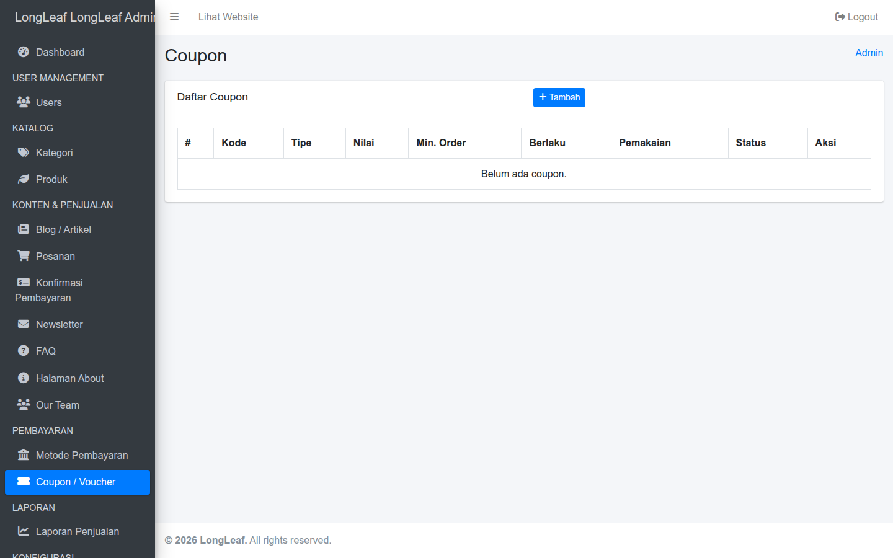

### Membuat Kupon Baru

1. Klik **Tambah Kupon**
2. Isi form:
   - **Kode** — 5 karakter huruf/angka kapital (contoh: `SAVE5`)
   - **Deskripsi** — keterangan internal
   - **Tipe Diskon** — `Persen (%)` atau `Fixed (Rp)`
   - **Nilai Diskon** — angka diskon
   - **Minimum Order** — nilai minimum belanja untuk bisa pakai kupon
   - **Maksimum Diskon** — batas maksimal potongan (untuk tipe persen)
   - **Batas Pemakaian** — berapa kali kupon bisa dipakai (kosongkan = unlimited)
   - **Berlaku Dari / Sampai** — periode aktif kupon
   - **Aktif** — toggle untuk mengaktifkan/menonaktifkan
3. Klik **Simpan**

---

## 8. Blog

**Menu:** Blog

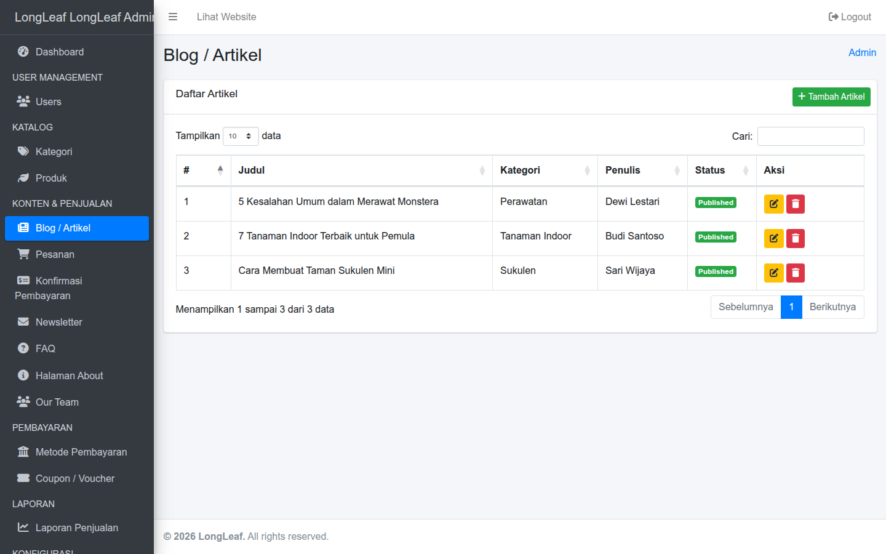

### Membuat Post Baru

1. Klik **Tambah Post**
2. Isi judul, slug, konten (editor CKEditor), gambar thumbnail
3. Pilih status: **Draft** (belum tayang) atau **Published** (tayang)
4. Klik **Simpan**

### Mengelola Post

- **Edit** — ubah konten, judul, atau status
- **Hapus** — hapus permanen
- Post dengan status Draft tidak muncul di halaman blog publik

---

## 9. FAQ

**Menu:** FAQ

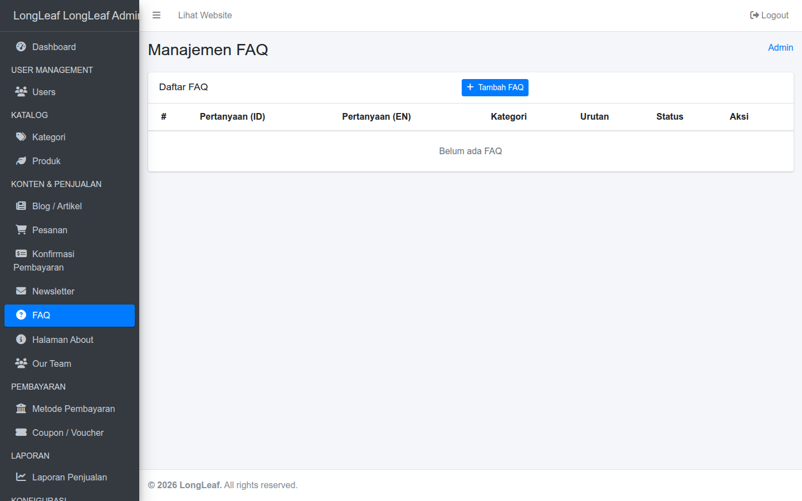

Kelola daftar pertanyaan yang sering diajukan yang tampil di halaman `/faq`.

| Aksi | Cara |
|---|---|
| Tambah | Klik **Tambah FAQ**, isi pertanyaan & jawaban |
| Edit | Klik ikon pensil |
| Hapus | Klik ikon tempat sampah |

---

## 10. Newsletter

**Menu:** Newsletter

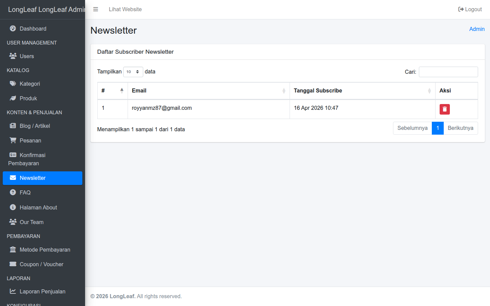

Menampilkan daftar email pelanggan yang mendaftar newsletter dari storefront.

- Tabel menampilkan email dan tanggal daftar
- Bisa digunakan sebagai referensi untuk kampanye email eksternal

---

## 11. Pengguna

**Menu:** Pengguna

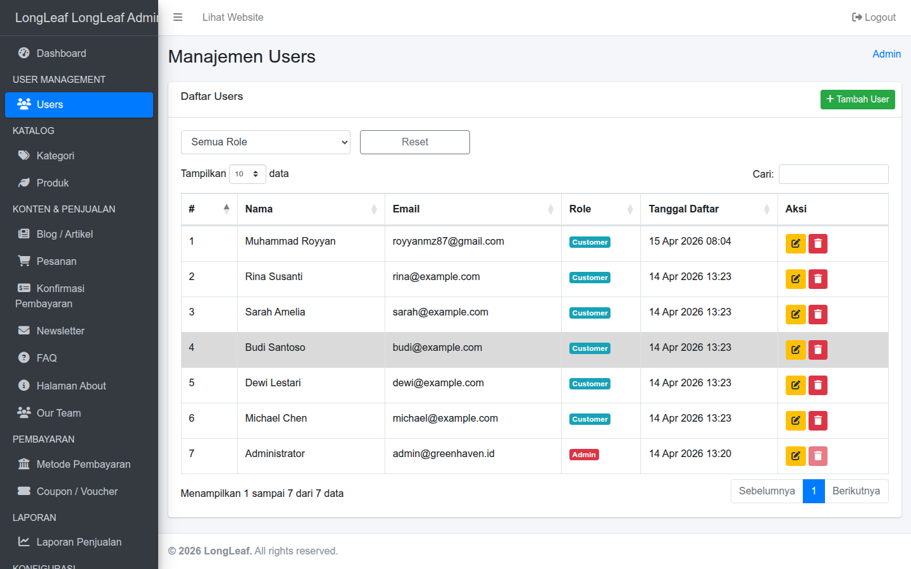

Kelola akun pelanggan yang terdaftar.

| Aksi | Cara |
|---|---|
| Lihat daftar | Tabel dengan nama, email, tanggal daftar |
| Edit | Ubah nama, email, atau reset password |
| Tambah | Buat akun pelanggan manual |
| Hapus | Hapus akun permanen |

---

## 12. Zona Pengiriman

**Menu:** Zona Pengiriman

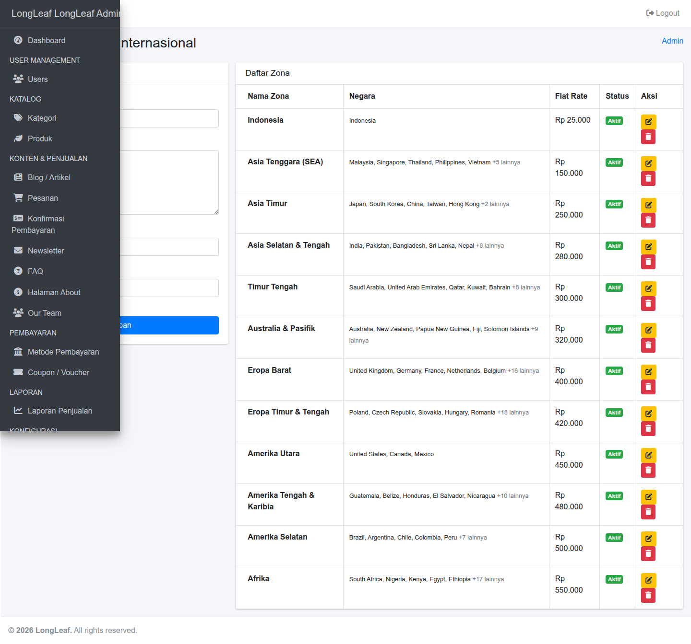

Digunakan untuk pengiriman **internasional** sebagai fallback jika Shippo tidak tersedia.

### Menambah Zona

1. Isi **Nama Zona** (contoh: `Asia Tenggara`)
2. Pilih **negara-negara** yang masuk zona ini
3. Isi **Flat Rate** — ongkos kirim tetap dalam Rupiah
4. Aktifkan toggle **Aktif**
5. Klik **Simpan**

> Pengiriman domestik Indonesia menggunakan RajaOngkir, dikonfigurasi di **Pengaturan API**.

---

## 13. Laporan Penjualan

**Menu:** Laporan → Penjualan

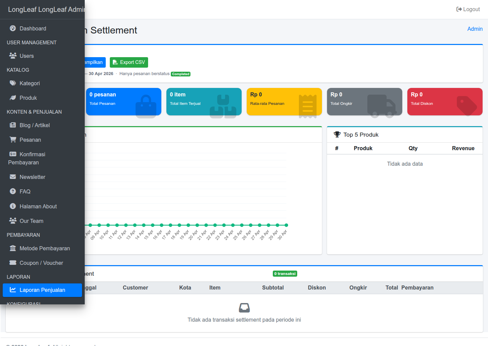

Menampilkan rekap penjualan berdasarkan rentang tanggal.

### Cara Menggunakan

1. Pilih **Tanggal Mulai** dan **Tanggal Akhir**
2. Klik **Filter**
3. Tabel menampilkan: nomor pesanan, pelanggan, produk, total, status, tanggal
4. Klik **Export CSV** untuk mengunduh laporan dalam format spreadsheet

---

## 14. Pengaturan API

**Menu:** Pengaturan API

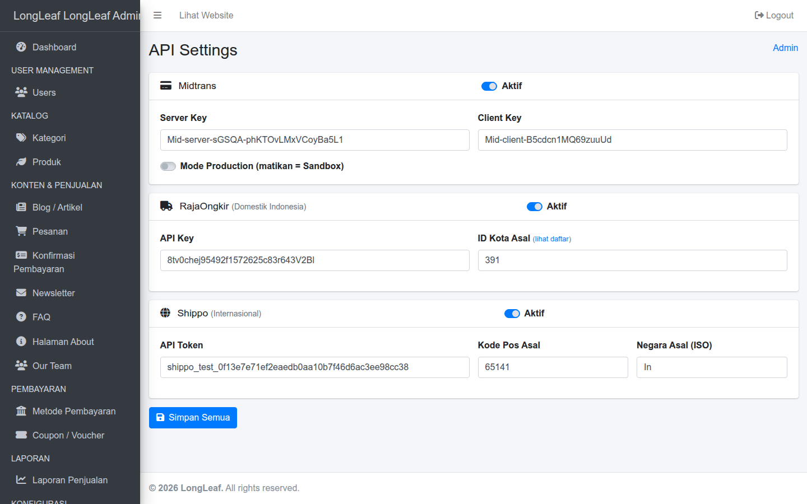

Konfigurasi integrasi layanan pihak ketiga.

### Midtrans (Payment Gateway)

| Field | Keterangan |
|---|---|
| Server Key | Kunci server dari dashboard Midtrans |
| Client Key | Kunci client dari dashboard Midtrans |
| Mode Production | Aktifkan untuk live, nonaktifkan untuk sandbox/testing |
| Toggle Aktif | Aktifkan/nonaktifkan Midtrans di checkout |

### RajaOngkir (Ongkos Kirim Domestik)

| Field | Keterangan |
|---|---|
| API Key | Kunci API dari akun RajaOngkir Komerce |
| Toggle Aktif | Aktifkan/nonaktifkan kalkulasi ongkir otomatis |

### Shippo (Pengiriman Internasional)

| Field | Keterangan |
|---|---|
| API Key | Kunci API dari akun Shippo |
| Toggle Aktif | Aktifkan/nonaktifkan Shippo |

### Groq AI

| Field | Keterangan |
|---|---|
| API Key | Kunci API dari console.groq.com |
| Digunakan untuk | Generate deskripsi produk & JEZY AI chat assistant |

---

## 15. Pengaturan Situs

**Menu:** Pengaturan

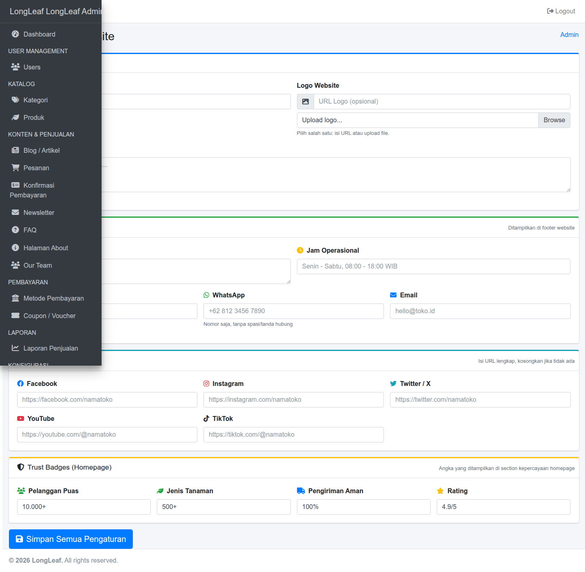

Konfigurasi tampilan dan informasi umum toko.

| Pengaturan | Keterangan |
|---|---|
| Nama Toko | Nama yang muncul di header dan email |
| Logo | Upload logo toko (disarankan PNG transparan) |
| Favicon | Ikon tab browser |
| Email Kontak | Email yang tampil di halaman kontak |
| Nomor Telepon | Nomor WhatsApp/telepon toko |
| Alamat | Alamat fisik toko |
| Media Sosial | Link Instagram, Facebook, TikTok, dll. |
| Trust Badges | Badge kepercayaan yang muncul di footer/checkout |
| Meta Description | Deskripsi SEO default situs |

---

## Tips Operasional

- **Pesanan baru masuk** → cek menu Pesanan, filter status `pending`
- **Ada bukti transfer masuk** → cek menu Konfirmasi Pembayaran
- **Stok habis** → edit produk, update angka stok atau nonaktifkan produk
- **Kupon tidak berfungsi** → pastikan tanggal masih berlaku dan toggle Aktif menyala
- **Ongkir tidak muncul** → cek API Key RajaOngkir di Pengaturan API
- **AI tidak merespons** → cek API Key Groq di Pengaturan API
